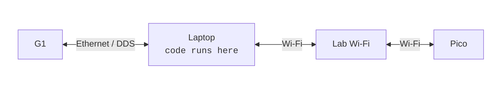
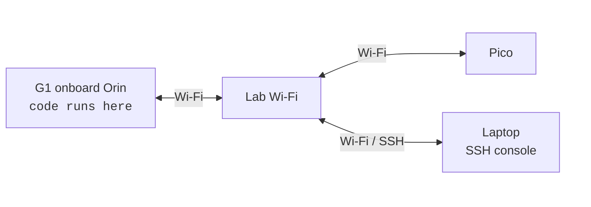
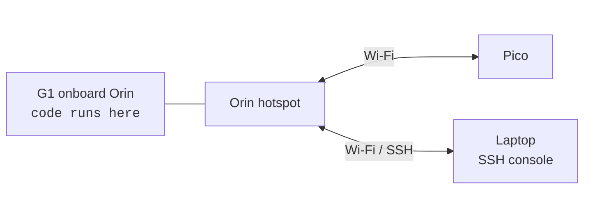

Choose the network layout before running on hardware. The important decision is where the `sim2real` processes run and which network carries the Pico stream.

## Wired Laptop Deployment

Use this layout when the laptop runs all code. The laptop talks to G1 over Ethernet and talks to Pico over the lab Wi-Fi.



Run `scripts/real_bridge.py` on the laptop and point it at the Ethernet interface connected to G1:

```bash
uv run scripts/real_bridge.py --robot g1 --interface <laptop_ethernet_interface>
```

Use `ip -br link` to find the interface name. Pico should stay on the lab Wi-Fi so the laptop and Pico can communicate through the lab network.

## External Wi-Fi Deployment

Use this layout when all runtime code runs on the onboard Orin, and both the Orin and laptop join the lab Wi-Fi. The laptop is only the operator console over SSH. Pico also joins the lab Wi-Fi and communicates with the Orin through that network.



SSH from the laptop into the Orin, then run the deployment commands on the Orin. Use this mode when the lab Wi-Fi is stable enough for Pico traffic and SSH control.

## Orin Wi-Fi Deployment

Use this layout when all runtime code runs on the onboard Orin, and the Orin provides its own hotspot through an external Wi-Fi adapter. The laptop and Pico both connect directly to that hotspot.



Create the hotspot on the Orin with the setup script:

```bash
bash scripts/setup/setup_g1_hotspot.sh \
  --interface wlan1 \
  --upstream wlan0 \
  --ssid hdmi-deploy \
  --password hdmi1234
```

The defaults create the hotspot on `wlan1` with `10.42.7.1/24` and route client traffic through `wlan0`. Connect the laptop and Pico to the hotspot. Pico and Orin then communicate directly through the Orin Wi-Fi adapter instead of the lab Wi-Fi.
