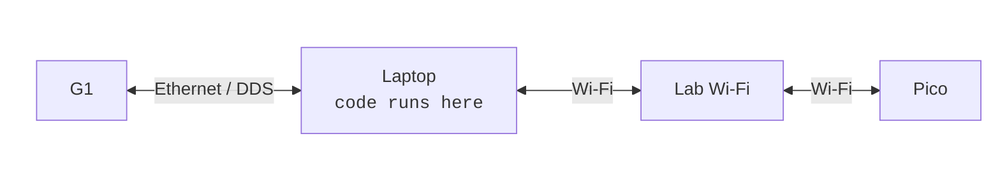
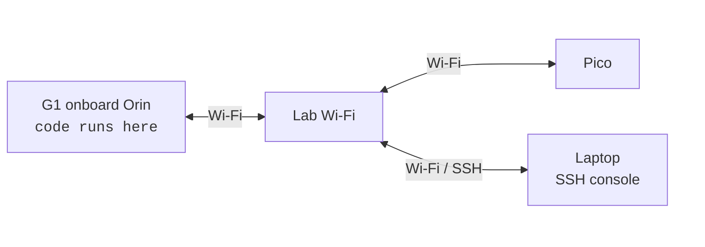
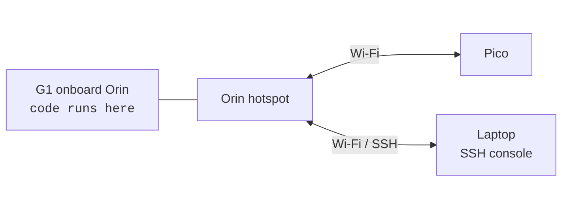
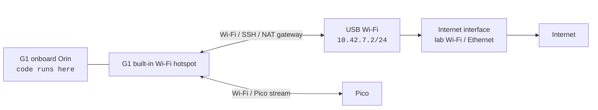

Choose the network layout before running on hardware. The important decision is where the `sim2real` processes run and which network carries the Pico stream.

## Wired Laptop Deployment

Use this layout when the laptop runs all code. The laptop talks to G1 over Ethernet and talks to Pico over the lab Wi-Fi.



If you choose a ZMQ bridge mode from [Robot I/O](/reference/robot-io), run the bridge on the laptop:

```bash
uv run scripts/real_bridge.py
```

Use `ip -br link` to find the interface name, and add
`--interface <laptop_ethernet_interface>` only when the Ethernet interface is
not the default `eth0`. Pico should stay on the lab Wi-Fi so the laptop and Pico
can communicate through the lab network.

## External Wi-Fi Deployment

Use this layout when all runtime code runs on the onboard Orin, and both the Orin and laptop join the lab Wi-Fi. The laptop is only the operator console over SSH. Pico also joins the lab Wi-Fi and communicates with the Orin through that network.



SSH from the laptop into the Orin, then run the deployment commands on the Orin. Use this mode when the lab Wi-Fi is stable enough for Pico traffic and SSH control.

## Orin Wi-Fi Deployment

Use this layout when all runtime code runs on the onboard Orin, and the Orin provides its own hotspot through an external Wi-Fi adapter. The laptop and Pico both connect directly to that hotspot.



Create the hotspot on the Orin with the setup script:

:::warning
Any operation that changes G1 network interfaces should be done with an Ethernet cable connected to G1. Keep the cable path available until the new Wi-Fi path has been verified.
:::

```bash
bash scripts/setup/setup_g1_hotspot.sh \
  --interface wlan1 \
  --upstream wlan0 \
  --ssid hdmi-deploy \
  --password hdmi1234
```

The defaults create the hotspot on `wlan1` with `10.42.7.1/24` and route client traffic through `wlan0`. Connect the laptop and Pico to the hotspot. Pico and Orin then communicate directly through the Orin Wi-Fi adapter instead of the lab Wi-Fi.

## Manual Built-In G1 Hotspot With Laptop Internet Egress

Use this layout when the external-adapter hotspot layout is not practical. The previous layout needs an extra Wi-Fi adapter on G1, but the G1 Type-C socket is easy to damage and may not reliably hold a dock.

The intended behavior is manual: G1 boots in normal Wi-Fi client mode, you SSH in through the normal Wi-Fi path, then you run one hotspot command on G1. That command switches the built-in G1 Wi-Fi interface into AP mode. The laptop then joins that hotspot and you reconnect to G1 through the `g1-hotspot` SSH host.



Configure the laptop SSH alias once:

```sshconfig
Host g1-hotspot
  HostName 10.42.7.1
  User elijah
```

Boot G1 normally and SSH into it through the existing Wi-Fi client path, for example:

```bash
ssh g1-rp
cd ~/sim2real
```

Then run the hotspot command on G1. Pass the built-in G1 Wi-Fi interface name, for example `wlan0`:

:::warning
This step switches the G1 built-in Wi-Fi interface from client mode to hotspot mode. The current Wi-Fi SSH session may disconnect. Keep an Ethernet recovery path available while changing this setup.
:::

```bash
bash scripts/setup/setup_g1_hotspot_via_laptop.sh \
  --interface wlan0 \
  --ssid hdmi-deploy \
  --password hdmi1234
```

This profile is intentionally not configured to autoconnect. After a reboot, rerun the script or manually start the profile with `sudo nmcli con up hdmi-g1-ap-via-laptop` only when the laptop gateway is available.

On the laptop, connect the laptop's USB Wi-Fi adapter to the G1 hotspot and enable NAT through the laptop's upstream internet interface:

```bash
bash scripts/setup/setup_laptop_g1_gateway.sh \
  --wifi-interface <laptop_usb_wifi_interface> \
  --upstream-interface <laptop_internet_interface> \
  --ssid hdmi-deploy \
  --password hdmi1234
```

The defaults use `10.42.7.1/24` on G1 and `10.42.7.2/24` on the laptop USB Wi-Fi adapter. The G1 default route points at `10.42.7.2`. The laptop keeps its own default route on `<laptop_internet_interface>` and only NATs the G1 hotspot subnet through that interface.

After the laptop joins the hotspot, connect to G1 through the hotspot address:

```bash
ssh g1-hotspot
```

After setup, verify both the local link and internet egress:

```bash
# On the laptop:
ping 10.42.7.1
ip route get 8.8.8.8

# On G1:
ping 10.42.7.2
ping 8.8.8.8
```

If G1 can reach `10.42.7.2` but cannot reach `8.8.8.8`, check that the laptop `--upstream-interface` is the interface that actually has internet access, and that laptop firewall rules allow forwarding.

To stop using the built-in Wi-Fi hotspot and return the interface to normal Wi-Fi client use, bring the hotspot profile down:

```bash
sudo nmcli con down hdmi-g1-ap-via-laptop
sudo systemctl stop hdmi-g1-ap-via-laptop-dnsmasq.service
```
