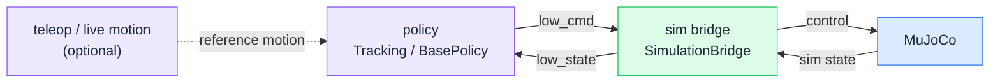
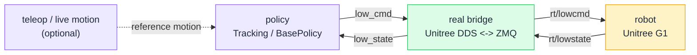

Start by cloning the repository:

```bash
git clone https://github.com/EGalahad/sim2real
```

`sim2real` is split into two environments:

- The root project is for policy inference, MuJoCo simulation, and the real bridge.
- `venv/teleop` is for Pico / XR retargeting, realtime viewing, and motion recording.

This project supports two hardware layouts:

- PC (`x86_64`) running the pipeline while controlling G1 over Ethernet.
- G1 onboard Orin running the entire pipeline locally on the robot.

## Runtime Architecture

The policy runtime is decoupled from the execution backend. In sim2sim, the
backend is MuJoCo. In sim2real, the same policy talks to the robot through the
real bridge.

### Sim2Sim



### Sim2Real



## Next Steps

- Choose a [Network Configuration](/getting-started/network-configuration) before running on hardware.
- Use [Root Project](/getting-started/root-project) if you only need policy, sim2sim, or the real bridge runtime.
- Use [Teleop Project (x86_64 PC)](/getting-started/teleop-x86-64) if Pico / XR tools run on a laptop or desktop.
- Use [Teleop Project (Onboard Orin)](/getting-started/teleop-onboard-orin) if teleop tooling runs on the robot.
