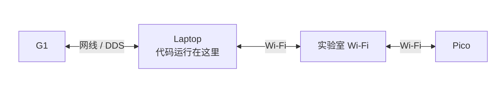
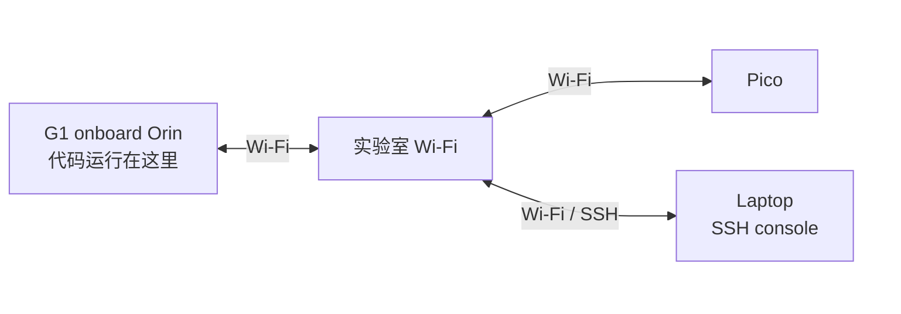
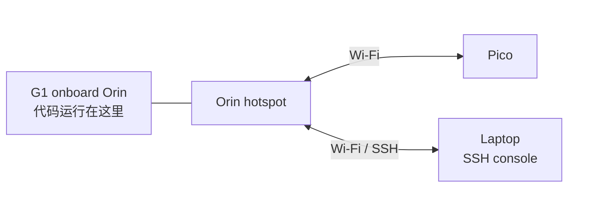

# Network Configuration

上硬件前先选网络布局。核心区别是 `sim2real` 进程跑在哪里，以及 Pico 数据流走哪张网。

## 有线部署

这种方式下所有代码都跑在 laptop 上。Laptop 通过网线连接 G1，通过实验室 Wi-Fi 和 Pico 通信。



在 laptop 上运行 `scripts/real_bridge.py`，并指定连接 G1 的本机有线网卡：

```bash
uv run scripts/real_bridge.py --robot g1 --interface <laptop_ethernet_interface>
```

可以用 `ip -br link` 查看网卡名。Pico 连接实验室 Wi-Fi，Laptop 和 Pico 之间通过实验室 Wi-Fi 通信。

## 外置 Wi-Fi 部署

这种方式下所有 runtime 代码都跑在 G1 onboard Orin 上。Orin 和 laptop 都连接实验室 Wi-Fi，laptop 通过 SSH 控制 Orin 命令行。Pico 也连接实验室 Wi-Fi，并通过实验室 Wi-Fi 和 Orin 通信。



从 laptop SSH 到 Orin 后，在 Orin 上运行部署命令。实验室 Wi-Fi 足够稳定时优先用这种方式，Pico 数据流和 SSH 控制都走同一个实验室网络。

## Orin Wi-Fi 部署

这种方式下所有 runtime 代码都跑在 G1 onboard Orin 上，同时给 G1 接一个无线网卡，并把 Orin 的无线网卡变成热点。Laptop 和 Pico 都直接连接这个热点。



在 Orin 上用 setup 脚本创建热点：

```bash
bash scripts/setup/setup_g1_hotspot.sh \
  --interface wlan1 \
  --upstream wlan0 \
  --ssid hdmi-deploy \
  --password hdmi1234
```

默认配置会在 `wlan1` 上创建热点，地址段为 `10.42.7.1/24`，并把 client 流量通过 `wlan0` 转发出去。Laptop 和 Pico 都连接这个热点后，Pico 和 Orin 会直接通过 Orin 上的无线网卡通信，不再依赖实验室 Wi-Fi。
