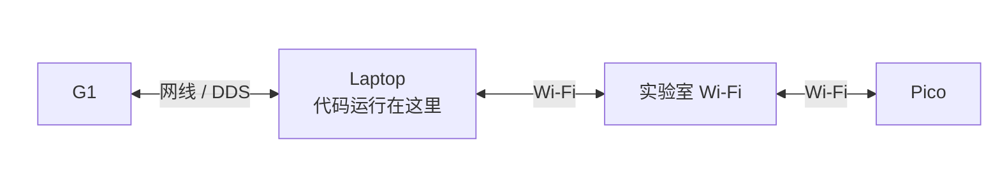
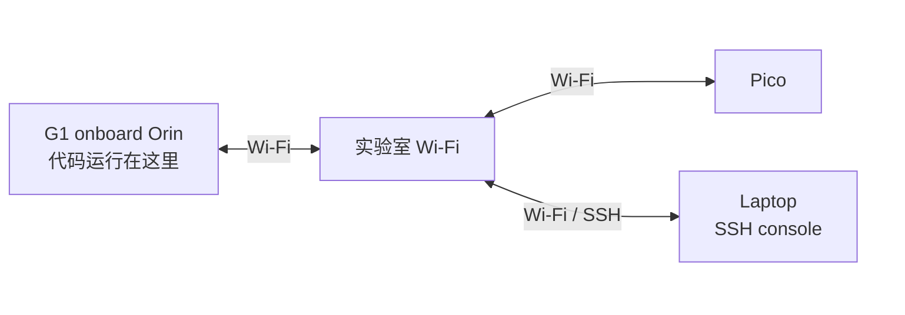
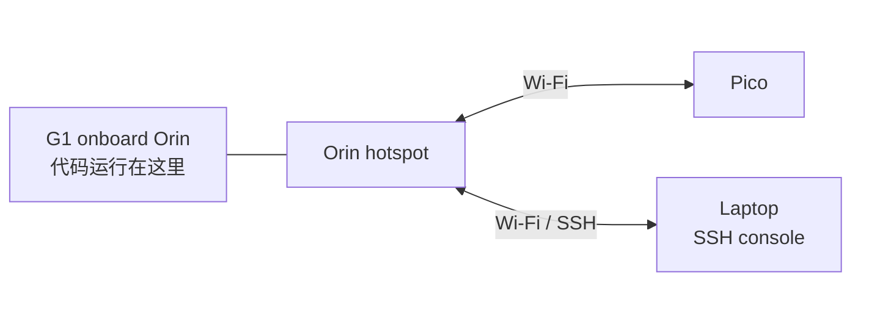
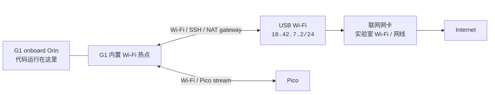

# Network Configuration

上硬件前先选网络布局。核心区别是 `sim2real` 进程跑在哪里，以及 Pico 数据流走哪张网。

## 有线部署

这种方式下所有代码都跑在 laptop 上。Laptop 通过网线连接 G1，通过实验室 Wi-Fi 和 Pico 通信。



如果你在 [Robot I/O](../reference/robot-io.md) 里选择了 ZMQ bridge 模式，就在 laptop 上运行 bridge：

```bash
uv run scripts/real_bridge.py
```

可以用 `ip -br link` 查看网卡名。只有有线网卡不是默认 `eth0` 时，才加
`--interface <laptop_ethernet_interface>`。Pico 连接实验室 Wi-Fi，Laptop 和 Pico
之间通过实验室 Wi-Fi 通信。

## 外置 Wi-Fi 部署

这种方式下所有 runtime 代码都跑在 G1 onboard Orin 上。Orin 和 laptop 都连接实验室 Wi-Fi，laptop 通过 SSH 控制 Orin 命令行。Pico 也连接实验室 Wi-Fi，并通过实验室 Wi-Fi 和 Orin 通信。



从 laptop SSH 到 Orin 后，在 Orin 上运行部署命令。实验室 Wi-Fi 足够稳定时优先用这种方式，Pico 数据流和 SSH 控制都走同一个实验室网络。

## Orin Wi-Fi 部署

这种方式下所有 runtime 代码都跑在 G1 onboard Orin 上，同时给 G1 接一个无线网卡，并把 Orin 的无线网卡变成热点。Laptop 和 Pico 都直接连接这个热点。



在 Orin 上用 setup 脚本创建热点：

:::warning
任何会修改 G1 网卡状态的操作，都应该在 G1 连接着网线的情况下执行。等新的 Wi-Fi 路径验证通过后，再断开网线。
:::

```bash
bash scripts/setup/setup_g1_hotspot.sh \
  --interface wlan1 \
  --upstream wlan0 \
  --ssid hdmi-deploy \
  --password hdmi1234
```

默认配置会在 `wlan1` 上创建热点，地址段为 `10.42.7.1/24`，并把 client 流量通过 `wlan0` 转发出去。Laptop 和 Pico 都连接这个热点后，Pico 和 Orin 会直接通过 Orin 上的无线网卡通信，不再依赖实验室 Wi-Fi。

## 手动开启 G1 内置网卡热点 + Laptop 出口

当上一种外置网卡方案不方便时，可以用这个布局。上一种方式需要在 G1 上接一个额外的无线网卡，但 G1 的 Type-C socket 比较容易损坏，也可能接不了扩展坞。

这个布局的正确行为是手动切换：G1 开机后保持普通 Wi-Fi client mode，你先通过普通 Wi-Fi SSH 到 G1；然后在 G1 上运行一个 hotspot command，把 G1 内置 Wi-Fi 切成 AP mode。Laptop 再连接这个热点，之后通过 `g1-hotspot` 这个 SSH host 连接 G1。



先在 laptop 上配置一次 SSH alias：

```sshconfig
Host g1-hotspot
  HostName 10.42.7.1
  User elijah
```

让 G1 正常开机，然后通过已有的普通 Wi-Fi client 路径 SSH 进去，例如：

```bash
ssh g1-rp
cd ~/sim2real
```

然后在 G1 上运行 hotspot command。`--interface` 传 G1 内置 Wi-Fi 的网卡名，例如 `wlan0`：

:::warning
这一步会把 G1 内置 Wi-Fi 从 client mode 切到 hotspot mode，当前 Wi-Fi SSH 可能会断开。修改这个设置时，请保留网线恢复路径。
:::

```bash
bash scripts/setup/setup_g1_hotspot_via_laptop.sh \
  --interface wlan0 \
  --ssid hdmi-deploy \
  --password hdmi1234
```

这个 profile 故意不设置成开机自动连接。G1 重启后，只有在 laptop gateway 已经准备好的情况下，才重新运行脚本，或者手动执行 `sudo nmcli con up hdmi-g1-ap-via-laptop`。

然后在 laptop 上，让外接 USB Wi-Fi 网卡连接 G1 热点，并通过 laptop 的上游联网网卡做 NAT：

```bash
bash scripts/setup/setup_laptop_g1_gateway.sh \
  --wifi-interface <laptop_usb_wifi_interface> \
  --upstream-interface <laptop_internet_interface> \
  --ssid hdmi-deploy \
  --password hdmi1234
```

默认配置会让 G1 使用 `10.42.7.1/24`，laptop 的 USB Wi-Fi 网卡使用 `10.42.7.2/24`。G1 的默认路由指向 `10.42.7.2`；laptop 保留自己的默认路由在 `<laptop_internet_interface>` 上，只把 G1 热点网段的流量 NAT 到这个上游网卡。

Laptop 连上热点后，通过热点地址重新连接 G1：

```bash
ssh g1-hotspot
```

配置完成后，同时验证局域网连通和 internet 出口：

```bash
# 在 laptop 上：
ping 10.42.7.1
ip route get 8.8.8.8

# 在 G1 上：
ping 10.42.7.2
ping 8.8.8.8
```

如果 G1 可以 ping 通 `10.42.7.2`，但 ping 不通 `8.8.8.8`，通常需要检查 laptop 的 `--upstream-interface` 是否选成了真正能上网的网卡，以及 laptop 防火墙是否允许 forwarding。

如果要停止使用 G1 内置 Wi-Fi 热点，让这个网卡回到普通 Wi-Fi client 用法，先关掉热点 profile：

```bash
sudo nmcli con down hdmi-g1-ap-via-laptop
sudo systemctl stop hdmi-g1-ap-via-laptop-dnsmasq.service
```
