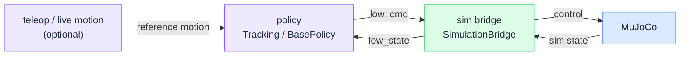
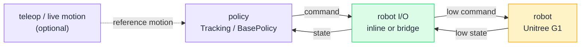

# Getting Started

开始前先克隆仓库：

```bash
git clone https://github.com/EGalahad/sim2real
```

`sim2real` 分成两个环境：

- root project 负责 policy inference、MuJoCo simulation，以及 robot I/O
- `venv/teleop` 负责 Pico / XR retarget、内置 mjviser viewing，以及 motion recording

当前支持两种硬件布局：

- PC (`x86_64`) 运行 teleop 工具，通过网线控制 G1
- G1 onboard Orin 本地运行整个 pipeline

## Runtime Architecture

policy runtime 和执行 backend 是解耦的。sim2sim 里 backend 是 MuJoCo；
sim2real 上真机时，在 [Robot I/O](/reference/robot-io) 里选择硬件通信方式。

### Sim2Sim



### Sim2Real



## Next Steps

- 先从 [Download Artifacts](/reference/artifacts) 下载 runtime 文件
- 上硬件前先选择 [Network Configuration](./network-configuration.md)
- 只需要 policy、sim2sim 或 robot I/O runtime 时，看 [Root Project](./root-project.md)
- 真机部署路径在 [Robot I/O](/reference/robot-io) 里选择
- Pico / XR 工具跑在 laptop / desktop 上时，看 [Teleop Project (x86_64 PC)](./teleop-x86-64.md)
- Pico / XR 工具跑在机载 Orin 上时，看 [Teleop Project (Onboard Orin)](./teleop-onboard-orin.md)
